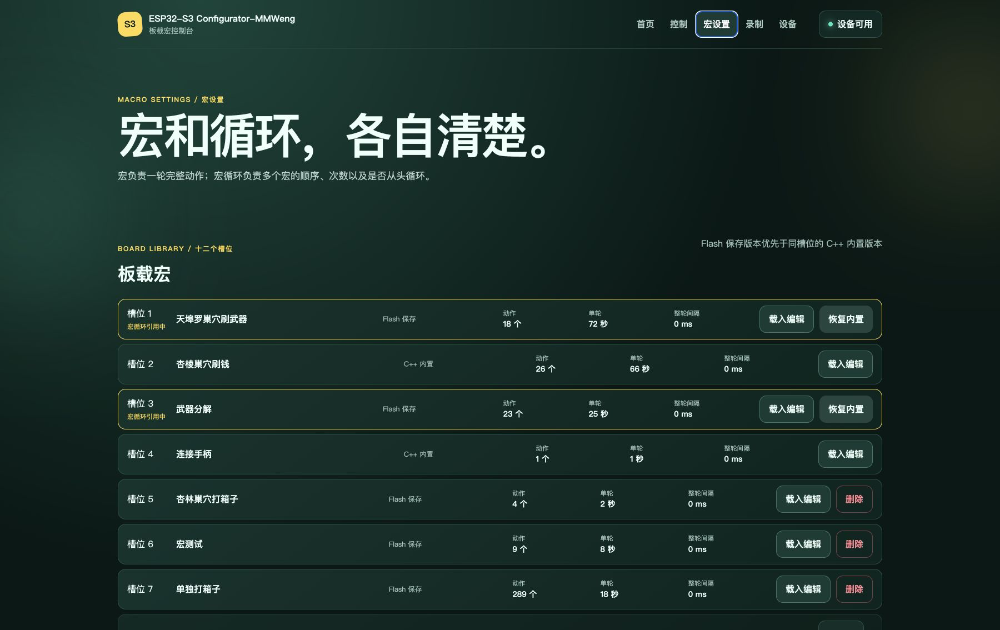
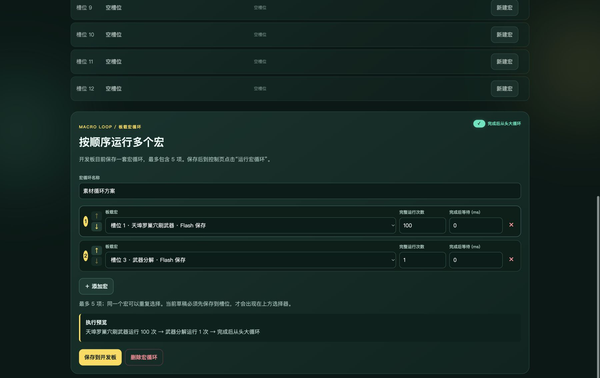
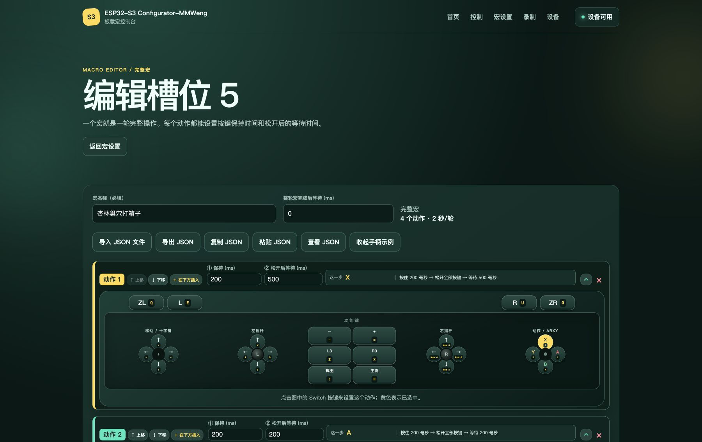

# ESP32-S3 Switch Macro Configurator

[简体中文文档](./README.md)

> [!IMPORTANT]
> This is a general-purpose Switch macro configurator. You can record, edit,
> and run custom macros for any game that accepts Nintendo Switch wired-controller
> input. The bundled Splatoon Raiders routines are replaceable examples and still
> require their own in-game prerequisites.

An ESP32-S3 Nintendo Switch wired-controller emulator and browser console.
Use it to record, edit, import, and run macros, then persist them in board
Flash or bind them to GPIO triggers. It is suitable for repetitive actions in
any game that supports Nintendo Switch wired-controller input.


Bundled Splatoon Raiders macro tutorial: [Bilibili](https://www.bilibili.com/video/BV12P3J6hE4h/)

Required setup for that example macro: [Bilibili](https://www.bilibili.com/video/BV1Hp3G6KEfs/)

## Features

- Emulates a wired Nintendo Switch controller over the ESP32-S3 native USB
  port while USB-UART remains available for browser control.
- Records, edits, imports, and runs custom button, D-pad, and dual-stick macros
  for any game that supports a Switch wired controller.
- Includes four replaceable C++ example macros in firmware: Tempura Nest weapon
  farming, Anling Nest money farming, weapon dismantling, and controller
  connection. Slots 5–12 are ready for custom scripts.
- Manages twelve macro slots in total. A script saved from the WebUI is stored
  in Flash and takes priority over the compiled script in the same slot; it can
  be deleted to restore that built-in script.
- Runs a selected macro continuously, or runs a board-resident task made of up
  to five macros with per-item repeat counts, completion gaps, and whole-plan
  looping.
- Keeps an active macro or task running if the browser or USB-UART connection
  drops. The board owns all timing, so ordinary serial jitter cannot interrupt
  a sequence halfway through.
- Provides a Vue 3 Web Serial console with home, control, script library,
  editor, recorder, and device/GPIO pages. Routing does not discard the live
  serial connection.
- Records controller actions, edits step-by-step macros, imports/exports
  version-2 JSON macros, and backs up or restores the full macro library.
- Supports browser controls, keyboard input, Xbox Elite 2, and PS5 DualSense
  recording, with precise analog and fixed-axis right-stick pulse modes.
- Supports twelve configurable GPIO macro triggers plus one stop trigger, so
  selected macros can run without a browser after configuration is saved.
- Provides all digital buttons, D-pad directions, and both analog sticks for
  mouse, touch, and keyboard input. Browser-held inputs are released when the
  tab loses focus or becomes hidden.

During automatic operation, the browser sends high-level start, stop, upload,
and status commands. Timing is owned by the microcontroller, so normal serial
jitter cannot break a sequence halfway through.

## Web console screenshots

The screenshots below were recaptured from the current WebUI after connecting
the board in the sidebar; slot data, task-loop data, and the “device available”
state come from the real device. Xbox Elite 2 and PS5 DualSense recording still
requires desktop Chrome or Edge and a controller connected on the Recorder
page.

### Macro settings and board task loop

Manage twelve macro slots and combine up to five saved macros into a board task
with per-item repeat counts, gaps, and whole-plan looping.





### Controller recording modes

The Recorder page maps Xbox and PS5 controller positions to Switch inputs and
offers precise analog recording or fixed-axis right-stick view pulses.


### Configure a macro with the virtual controller

Expand each action to configure buttons, the D-pad, and both sticks directly
through the visual Switch controller.



## Hardware

The recommended board is an `ESP32-S3-DevKitC-1` with separate native USB and
USB-UART connectors.

| Link | Board connection | Purpose |
| --- | --- | --- |
| Native USB | GPIO19 D- / GPIO20 D+ | Wired controller to the Switch dock |
| USB-UART | UART0 through the onboard bridge | Browser control from the computer |

Both links can stay connected at the same time. See the
[ESP32-S3-DevKitC-1 user guide](https://docs.espressif.com/projects/esp-dev-kits/en/latest/esp32s3/esp32-s3-devkitc-1/user_guide_v1.0.html)
for connector placement.

If the board exposes only native USB, connect an external USB-UART adapter:

- GPIO43 / TX0 to adapter RX
- GPIO44 / RX0 to adapter TX
- GND to GND

Do not connect the adapter VCC when the board is already powered from the
Switch. For the strongest protection against host-side reset signals, use only
TX, RX, and GND.

## Build and flash

Install Python 3 and [PlatformIO Core](https://docs.platformio.org/en/latest/core/index.html):

```bash
python3 -m pip install platformio==6.1.19
pio run
```

The environment targets `ESP32-S3-DevKitC-1-N8`, Arduino-ESP32 2.0.17, and
pins [`switch_ESP32`](https://github.com/esp32beans/switch_ESP32) to a known
working commit. Flash through the board's USB-UART connector:

```bash
pio run -t upload --upload-port /dev/cu.usbserial-XXXX
```

Use a port such as `COM5` on Windows or `/dev/ttyUSB0` on Linux. After flashing:

1. Connect native USB to the Nintendo Switch dock.
2. Connect USB-UART to the computer.
3. Start the local WebUI.

```bash
npm run serve
```

Open <http://localhost:5173> in desktop Chrome or Edge. Web Serial requires a
secure context, so opening `web/index.html` directly is not supported.

## Use

1. Select **连接设备** and choose the DevKitC-1 USB-UART port.
2. Open **Control** to run one script continuously, or open **Scripts** to
   edit slots and configure a board task.
3. Select **立即停止** to send a neutral controller report.

Disconnecting USB-UART does not stop an already running routine. Reconnect and
stop it, reset the board, or remove power when you need to end it.

### Web console

| Route | Purpose |
| --- | --- |
| `#/` | Connection state, current macro status, and quick start/stop |
| `#/control` | Run the selected macro and use the manual controller deck |
| `#/scripts` | Manage the twelve slots and create a board task plan |
| `#/scripts/:slot/edit` | Edit a macro step by step, then upload it transactionally |
| `#/recorder` | Record button input and turn it into an editable macro |
| `#/device` | Inspect device information and configure offline GPIO triggers |

One macro always represents one complete run. Direct start loops that run until
stopped. The recorder, editor, and import/export functions use explicit version
2 JSON formats; old JSON is rejected instead of being silently migrated.

### Built-in macros and slot priority

| Slot | Built-in macro | C++ source |
| --- | --- | --- |
| 1 | Tempura Nest weapon farming | `firmware/src/builtins/TempuraNestWeaponFarm.cpp` |
| 2 | Anling Nest money farming | `firmware/src/builtins/AnlingNestMoneyFarm.cpp` |
| 3 | Weapon dismantling | `firmware/src/builtins/WeaponDismantle.cpp` |
| 4 | Connect controller | `firmware/src/builtins/ConnectController.cpp` |
| 5–12 | Empty by default | Available for custom macros |

For each slot, the runtime priority is **WebUI Flash script > compiled C++
built-in**. Editing a built-in slot in the WebUI does not change the C++ source;
it creates a persistent Flash override. Use **Restore built-in** (or
`MACRO_RESTORE slot`) to remove the override and reveal the compiled macro.

### GPIO offline triggers

The device page can save twelve macro-start GPIO entries and one dedicated stop
GPIO entry. Pins are checked against the firmware's safe allowlist, and the
configuration is uploaded transactionally with a checksum. After saving, the
board can start the assigned macro without a browser; disconnecting the
USB-UART cable does not cancel an already running macro.

### Manual controls

Manual input temporarily overrides the current controller report; it does not
stop an automatic macro. When released, the macro takes ownership again at its
next action stage. Use **立即停止**, `STOP`, `TASK_STOP`, or the stop GPIO trigger
to end a macro or board task. Buttons support hold, multi-key combinations,
mouse, multitouch, and keyboard.

| Controller | Keyboard | Controller | Keyboard |
| --- | --- | --- | --- |
| X / Y / B / A | I / J / K / L | D-pad | Arrow keys |
| L / ZL | Q / E | R / ZR | O / U |
| L3 / R3 | Z / X | − / + | − / = |
| Capture / Home | C / H | | |
| Left stick | W / A / S / D | Right stick | 8 / 4 / 5 / 6 |

If USB-UART is physically unplugged while a button is held, the browser cannot
send the final neutral report. Reset the board to release that last state.

## Serial protocol

The control link is `115200 baud`, ASCII, one command per line.

| Command | Behavior |
| --- | --- |
| `HELLO` / `INFO` | Return firmware, routine metadata, and current state as JSON |
| `START` / `MACRO_START slot` | Start the selected macro, or start a specified slot, from step 1 |
| `STOP` | Stop and send a fully neutral controller report |
| `STATUS` | Return phase, step, cycle count, and timing |
| `PING` | Return `PONG` |
| `MACRO_GET` | Return the active complete macro as JSON |
| `MACRO_LIST` | Return the twelve macro slots and active slot as JSON |
| `MACRO_BEGIN slot steps gap repeat` | Begin a transactional macro upload |
| `MACRO_STEP index hold wait buttons dpad lx ly rx ry` | Add one macro action with hold and post-action wait |
| `MACRO_COMMIT checksum` | Validate and persist the pending macro upload |
| `MACRO_LOAD slot` | Stop and load one saved slot as the active macro |
| `MACRO_DELETE slot` | Stop and delete one saved slot |
| `MACRO_RESTORE slot` | Delete a Flash override and restore the slot's C++ built-in macro |
| `TASK_GET` / `TASK_START` / `TASK_STOP` / `TASK_DELETE` | Read, run, stop, or delete the board task plan |
| `TASK_BEGIN 5` / `TASK_META` / `TASK_ENTRY` / `TASK_COMMIT` | Transactionally save up to five complete-script task items |
| `TRIGGER_GET` / `TRIGGER_DEFAULT` | Read the GPIO trigger configuration or restore defaults |
| `TRIGGER_BEGIN` / `TRIGGER_ENTRY` / `TRIGGER_STOP_PIN` / `TRIGGER_COMMIT` | Transactionally save GPIO triggers |
| `R buttons dpad lx ly rx ry` | Send one complete temporary HID report |

The raw report command keeps the firmware useful for future computer-loaded
routines without changing the board protocol.

## Development

```bash
npm install
npm test
npm run build
pio run
```

The test suite covers:

- Embedded step count, duration, action boundaries, and compact Flash size
- Loop-gap boundaries, stop neutralization, and `millis()` wraparound
- Status parsing and the simulated serial transport
- All 14 button bits, cardinal/diagonal D-pad input, keyboard mapping, and
  multi-source press/release behavior

Project layout:

- `firmware/src/builtins/` — one C++ source file for each built-in macro
- `firmware/src/BuiltinMacroLibrary.cpp` — built-in slot registry
- `firmware/include/ControllerPresets.h` — shared controller reports, button masks, and stick directions
- `firmware/src/MacroLibrary.cpp` — persistent twelve-slot Flash macro library
- `firmware/src/MacroEngine.cpp` — non-blocking loop engine
- `firmware/src/main.cpp` — USB HID, serial protocol, and device main loop
- `firmware/src/TaskPlanStorage.cpp` — persistent five-item board task plan
- `web/src/` — Vue 3, Vue Router, Pinia, and Web Serial console
- `web/src/utils/` — macro JSON, controller mapping, serial protocol, backup, and task-plan utilities
- `tests/` — host-side firmware and browser-logic tests

For a Chinese, file-by-file firmware learning guide, see
[firmware/README-ZH.md](./firmware/README-ZH.md).

## License and disclaimer

This project is released under the
[GNU General Public License v3.0](./LICENSE). Third-party attribution is in
[NOTICE.md](./NOTICE.md).

This is an unofficial fan project and is not affiliated with, endorsed by, or
sponsored by Nintendo. Splatoon, Splatoon Raiders, Nintendo Switch, and related
names and marks belong to their respective owners. Use automation responsibly;
the project is intended for offline, single-player material farming.

## Credits

Thanks to [我的茕茕孑立](https://space.bilibili.com/35615481) for the original game controller macro.
