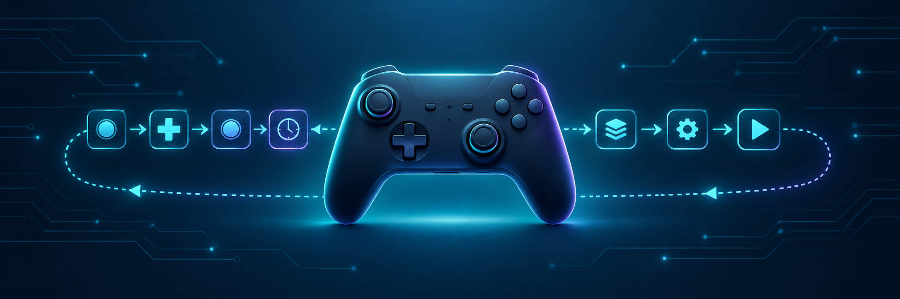
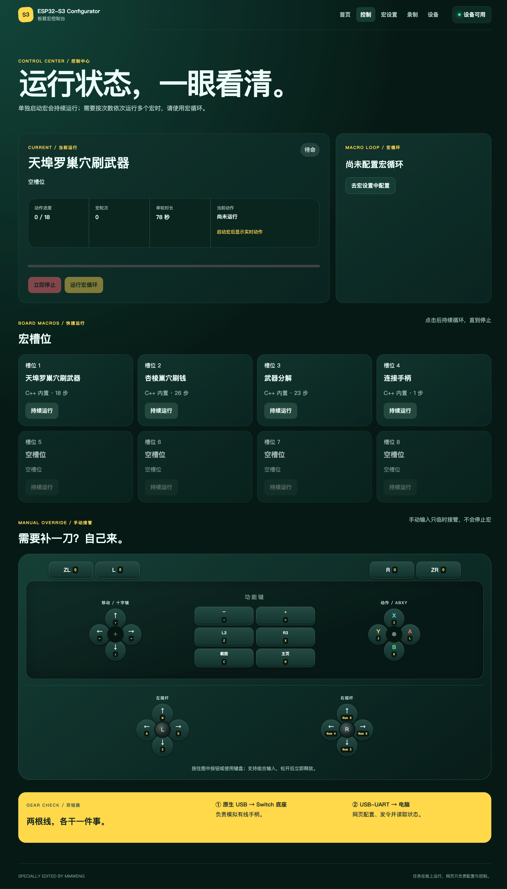
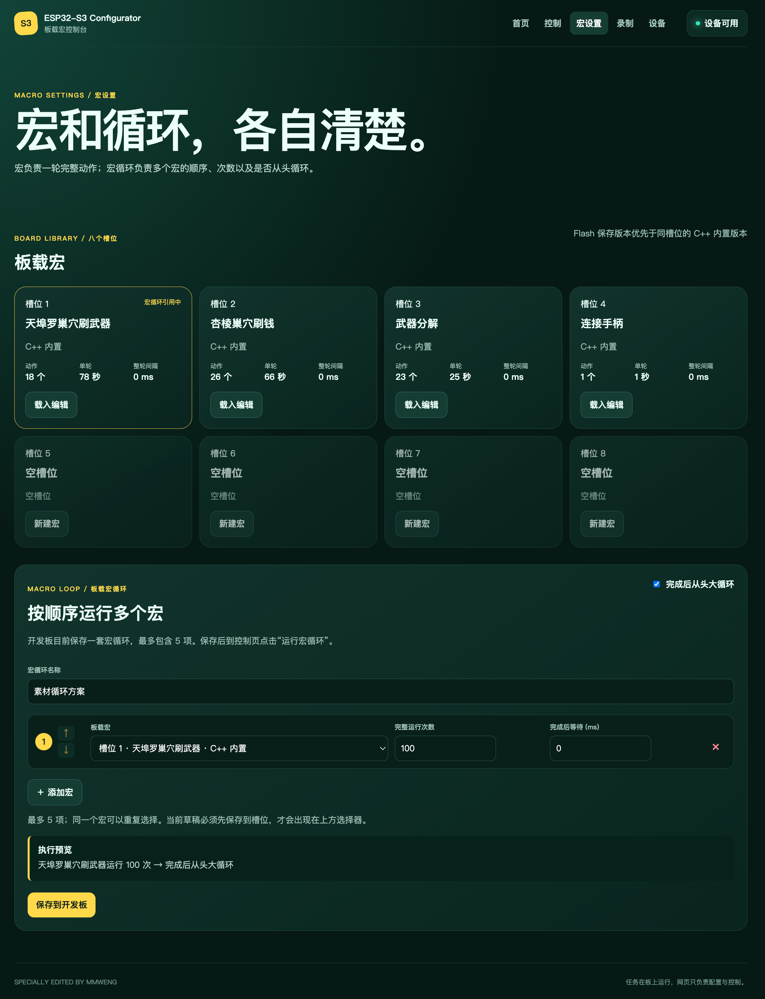
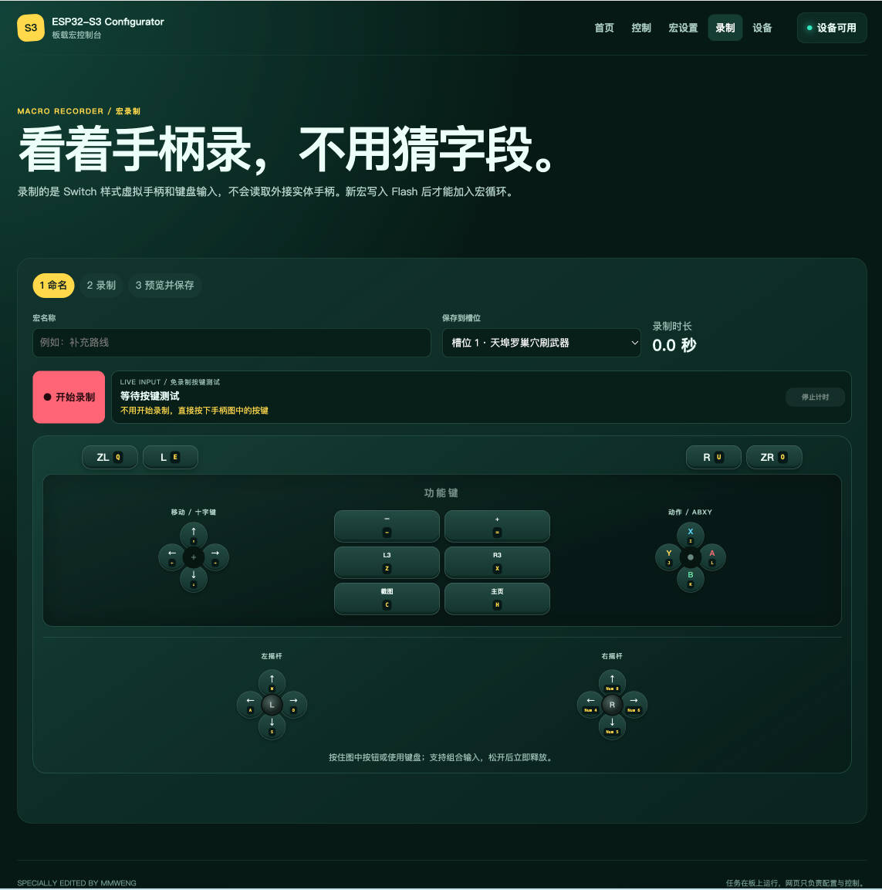
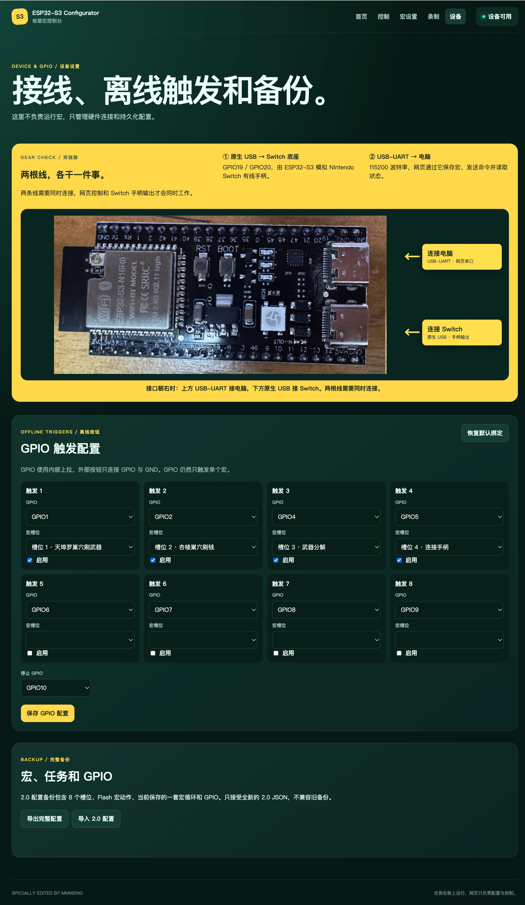
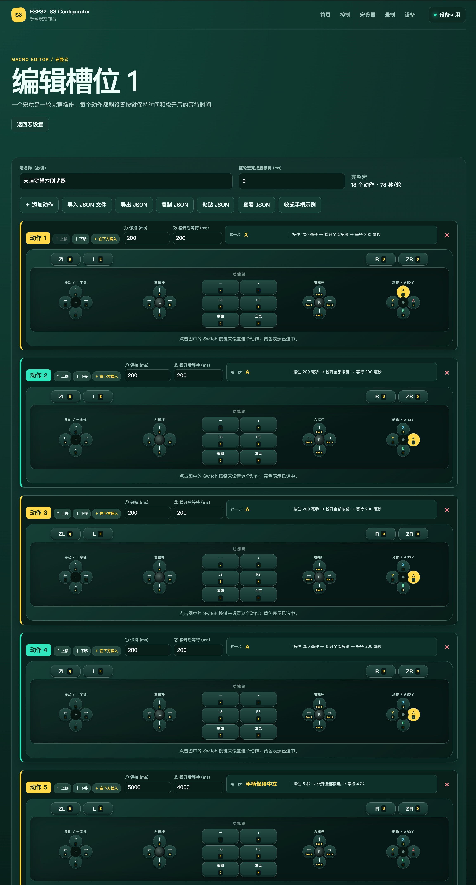
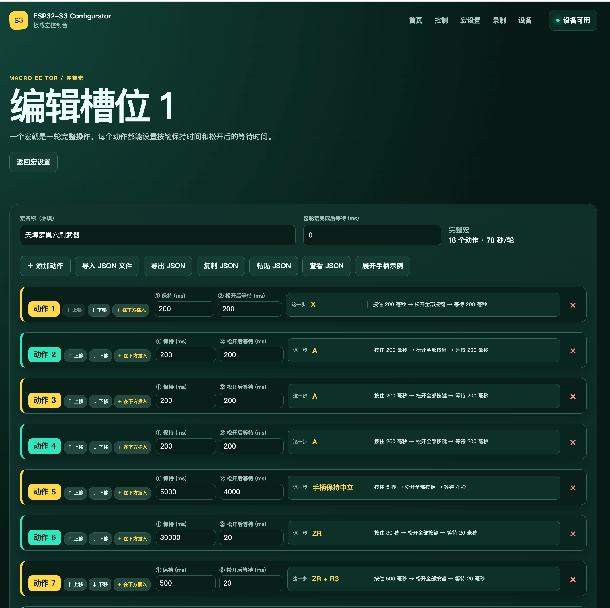
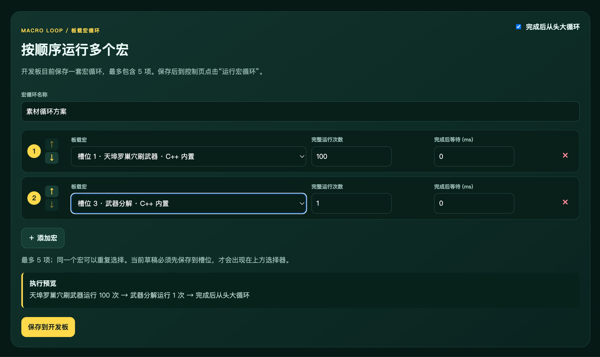

# ESP32-S3 Switch Macro Configurator

[English README](./README-en.md)

Vue 3 控制台、宏录制、十二个脚本槽位和五段板载任务说明，请参阅：
[《Vue 控制台与板载任务方案说明》](./Vue控制台与板载任务方案说明.md)

固件各文件的中文职责、数据流和阅读顺序请参阅：
[《固件目录学习导航》](./firmware/README-ZH.md)

> [!IMPORTANT]
> 这是一个通用的 Switch 宏配置器：可为所有支持 Nintendo Switch 有线手柄输入的游戏录制、编辑和运行自定义宏。内置的《Splatoon Raiders》流程只是可替换示例；使用这些特定流程前，仍需自行完成其所依赖的游戏内前置条件。

这是一个基于 ESP32-S3 的 Nintendo Switch 有线手柄模拟器与浏览器控制台。通过网页可录制、编辑、导入和运行宏，并将其保存到开发板 Flash 或绑定到 GPIO；因此可用于各类支持 Switch 有线手柄输入的游戏与重复操作场景。



内置《Splatoon Raiders》示例宏教程：[哔哩哔哩](https://www.bilibili.com/video/BV12P3J6hE4h/)

该示例宏所需装备说明：[哔哩哔哩](https://www.bilibili.com/video/BV1Hp3G6KEfs/)

## 功能

- 通过 ESP32-S3 的原生 USB 接口模拟 Nintendo Switch 有线手柄，适合所有支持有线手柄输入的 Switch 游戏。
- 可为任意游戏录制、编辑、导入并运行自定义按键、十字键和双摇杆宏，不限定某个游戏或固定流程。
- 固件内置 4 个可替换示例宏：天埠罗巢穴刷武器、杏棱巢穴刷钱、武器分解和连接手柄；第 5～12 槽预留给自定义宏。
- 共管理 12 个宏槽位。网页保存的脚本写入 Flash，同槽位下会优先于 C++ 内置脚本运行；删除网页覆盖即可恢复内置版本。
- 宏编辑器支持逐步骤编辑、事务式上传与校验；录制器支持将实际按键操作转换为可编辑宏；支持 v2 JSON 宏导入导出及完整脚本库备份恢复。
- 支持单宏无限循环，也支持最多 5 项的板载跨脚本任务；每项可设置运行次数和完成后间隔，整个任务方案还可整体循环。
- 浏览器或 USB-UART 断开后，正在运行的宏或板载任务仍会继续；关键时序完全由 ESP32-S3 执行，不受普通串口抖动影响。
- 提供 Vue 3 + Vite 单页控制台：首页、控制、脚本库、编辑器、录制器和设备/GPIO 页面切换时均保持同一次 Web Serial 连接。
- 支持 12 个可配置的 GPIO 启动触发器和 1 个停止触发器，保存后无需浏览器也能启动指定宏。
- 提供全部数字按键、十字键和双摇杆的鼠标、触摸与键盘操作；页面失焦或隐藏时会释放浏览器保持的输入。

自动运行期间，浏览器只发送启动、停止、上传和状态查询等高层级命令。
时序由微控制器负责，因此正常的串口抖动不会导致序列在执行途中被破坏。

## 控制台界面

前五张截图按文件编号 1～5 排列，展示网页控制台的主要页面；随后展示宏编辑器展开和收起手柄示例时的对比。

<a id="console-gallery"></a>

### 快速跳转

| 图例 | 主要功能 | 直达 |
| --- | --- | --- |
| 首页 | 连接状态、当前宏与功能入口 | [查看首页](#console-home) |
| 控制中心 | 启动/停止、运行进度与手动接管 | [查看控制中心](#console-control) |
| 宏设置 | 宏槽位与板载宏循环 | [查看宏设置](#console-scripts) |
| 宏录制 | 虚拟手柄录制新宏 | [查看宏录制](#console-recorder) |
| 设备与 GPIO | 接线、离线触发与备份 | [查看设备与 GPIO](#console-device) |
| 宏编辑器 | 展开手柄示例 / 收起步骤总览 | [展开](#console-editor-expanded) · [收起](#console-editor-collapsed) |
| 板载宏循环 | 顺序、次数与整轮循环设置 | [查看宏循环](#console-task-loop) |

<a id="console-home"></a>

### 1. 首页

连接设备后可查看当前宏、运行状态和宏循环概览，并快速进入各功能页面。


[↑ 返回快速跳转](#console-gallery)

<a id="console-control"></a>

### 2. 控制中心

运行指定宏、查看步骤进度和循环次数；下方提供全部按键及双摇杆的临时手动接管。



[↑ 返回快速跳转](#console-gallery)

<a id="console-scripts"></a>

### 3. 宏设置

管理 12 个宏槽位、载入或新建宏，并将最多 5 个宏按顺序组合为板载宏循环。



[↑ 返回快速跳转](#console-gallery)

<a id="console-recorder"></a>

### 4. 宏录制

通过屏幕上的虚拟 Switch 手柄录制按键和摇杆动作，预览后保存至目标槽位。



[↑ 返回快速跳转](#console-gallery)

<a id="console-device"></a>

### 5. 设备与 GPIO

查看双 USB 接线方式，配置离线 GPIO 触发器，并导出或导入宏、任务和 GPIO 的完整备份。



[↑ 返回快速跳转](#console-gallery)

<a id="console-editor-expanded"></a>

### 宏编辑器：展开手柄示例

每一个动作都可直接通过可视化 Switch 手柄配置按键、十字键和摇杆，适合逐步创建新的游戏宏。



[↑ 返回快速跳转](#console-gallery)

<a id="console-editor-collapsed"></a>

### 宏编辑器：收起步骤总览

点击“收起手柄示例”后，隐藏每一步的大型手柄面板，仅保留动作、保持时间、等待时间和动作摘要，方便快速检查完整宏的所有步骤；再次点击即可展开。



[↑ 返回快速跳转](#console-gallery)

<a id="console-task-loop"></a>

### 板载宏循环

将最多 5 个已保存的宏按顺序编排为一个板载任务。每一项可独立设置完成运行次数与完成后等待时间，并可选择在全部项目完成后从头循环；保存到开发板后，无需持续连接浏览器也能执行。



[↑ 返回快速跳转](#console-gallery)

## 硬件

推荐使用 `ESP32-S3-DevKitC-1` 开发板，它具有彼此独立的原生 USB 和 USB-UART 接口。

| 连接 | 开发板接口 | 用途 |
| --- | --- | --- |
| 原生 USB | GPIO19 D- / GPIO20 D+ | 作为有线手柄连接到 Switch 底座 |
| USB-UART | 通过板载桥接芯片连接 UART0 | 从电脑端浏览器进行控制 |

两路连接可以同时保持接通。接口位置请参阅
[ESP32-S3-DevKitC-1 用户指南](https://docs.espressif.com/projects/esp-dev-kits/en/latest/esp32s3/esp32-s3-devkitc-1/user_guide_v1.0.html)。

如果开发板只引出了原生 USB，请连接外置 USB-UART 转接器：

- GPIO43 / TX0 连接转接器 RX
- GPIO44 / RX0 连接转接器 TX
- GND 连接 GND

如果开发板已经由 Switch 供电，请勿连接转接器的 VCC。为了最大程度避免主机端复位信号的影响，
只连接 TX、RX 和 GND。

## 构建与烧录

安装 Python 3 和 [PlatformIO Core](https://docs.platformio.org/en/latest/core/index.html)：

```bash
python3 -m pip install platformio==6.1.19
pio run
```

构建环境以 `ESP32-S3-DevKitC-1-N8` 和 Arduino-ESP32 2.0.17 为目标，
并将 [`switch_ESP32`](https://github.com/esp32beans/switch_ESP32) 固定到一个已知可用的提交。
请通过开发板的 USB-UART 接口烧录：

```bash
pio run -t upload --upload-port /dev/cu.usbserial-XXXX
```

Windows 请使用类似 `COM5` 的端口，Linux 请使用类似 `/dev/ttyUSB0` 的端口。烧录完成后：

1. 将原生 USB 连接到 Nintendo Switch 底座。
2. 将 USB-UART 连接到电脑。
3. 启动本地 WebUI。

```bash
npm run serve
```

使用桌面版 Chrome 或 Edge 打开 <http://localhost:5173>。Web Serial 要求安全上下文，
因此不支持直接打开 `web/index.html`。

首页、控制、宏设置、录制和设备设置使用 Hash 路由，可从顶部导航进入；也可以使用 `?mock=1` 打开模拟设备模式，方便不接开发板时查看界面。

## 使用方法

1. 点击 **连接设备**，然后选择 DevKitC-1 的 USB-UART 端口。
2. 等待状态显示为 **已连接 · 待命**。
3. 在控制页直接运行宏；在宏设置页编辑、录制、导入导出或恢复内置宏，并配置最多 5 项的板载任务方案。
4. 点击 **停止**，立即发送一份所有输入均处于中立状态的手柄报告。

断开 USB-UART 不会停止已经运行的流程。需要结束流程时，请重新连接并将其停止、复位开发板，
或断开电源。

## 网页页面说明

| 路径 | 用途 |
| --- | --- |
| `#/` | 显示连接状态、当前宏进度并提供快速开始/停止 |
| `#/control` | 运行当前宏，并提供手动手柄控制面板 |
| `#/scripts` | 管理 12 个宏槽位，并创建板载任务方案 |
| `#/scripts/:slot/edit` | 逐步骤编辑宏，再以事务方式上传至开发板 |
| `#/recorder` | 录制按键操作并生成可继续编辑的宏 |
| `#/device` | 查看设备信息并设置 GPIO 离线触发 |

一个宏代表一次完整流程，直接启动后会循环执行，直到停止。未保存的浏览器草稿不能加入板载任务。宏和完整脚本库只接受明确的 v2 JSON 格式，旧格式会被拒绝，而不会被静默转换。

## 内置宏与槽位优先级

| 槽位 | C++ 内置宏 | 源文件 |
| --- | --- | --- |
| 槽 1 | 天埠罗巢穴刷武器 | `firmware/src/builtins/TempuraNestWeaponFarm.cpp` |
| 槽 2 | 杏棱巢穴刷钱 | `firmware/src/builtins/AnlingNestMoneyFarm.cpp` |
| 槽 3 | 武器分解 | `firmware/src/builtins/WeaponDismantle.cpp` |
| 槽 4 | 连接手柄 | `firmware/src/builtins/ConnectController.cpp` |
| 槽 5～12 | 默认空白 | 用于自定义宏 |

同一槽位的运行优先级为：**网页保存的 Flash 脚本 > 编译进固件的 C++ 内置脚本**。因此，在网页修改内置宏只会生成 Flash 覆盖，不会改写 C++ 源文件。点击网页的 **恢复内置脚本**，或发送 `MACRO_RESTORE slot`，会删除该槽位的 Flash 覆盖并重新使用 C++ 版本。

## GPIO 离线触发

设备页可以保存 12 条 GPIO 启动规则（每条可绑定一个宏槽位，或启动已保存的宏循环），以及 1 条停止规则。固件只允许安全白名单中的引脚，并使用带校验和的事务协议保存配置。配置成功后，即使没有打开网页或拔掉 USB-UART，按下已配置的 GPIO 仍可启动对应宏或宏循环；但拔线不会终止已经在运行的宏。

### 手动控制

手动输入只会临时覆盖当前手柄状态，不会停止正在运行的宏。松开后宏会在下一个动作阶段继续接管；只有网页“立即停止”、STOP/TASK_STOP 指令或 Stop GPIO 会停止宏。
页面失去焦点或标签页被隐藏时，浏览器会释放其保持的所有输入。

| 手柄 | 键盘 | 手柄 | 键盘 |
| --- | --- | --- | --- |
| X / Y / B / A | I / J / K / L | 十字键 | 方向键 |
| L / ZL | Q / E | R / ZR | O / U |
| L3 / R3 | Z / X | − / + | − / = |
| 截图键 / Home | C / H | | |
| 左摇杆 | W / A / S / D | 右摇杆 | 8 / 4 / 5 / 6 |

如果按住某个按键时 USB-UART 被物理拔出，浏览器将无法发送最后一份中立状态报告。
请复位开发板以释放最后保持的状态。

## 串口协议

控制链路使用 `115200 baud`、ASCII 编码，每行一条命令。

| 命令 | 行为 |
| --- | --- |
| `HELLO` / `INFO` | 以 JSON 格式返回固件、流程元数据和当前状态 |
| `START` / `MACRO_START slot` | 从第 1 步启动当前宏，或直接启动指定的 `0～11` 槽位 |
| `STOP` | 停止流程并发送一份完全中立的手柄报告 |
| `STATUS` | 返回当前阶段、步骤、循环次数和时间信息 |
| `PING` | 返回 `PONG` |
| `R buttons dpad lx ly rx ry` | 发送一份临时的完整 HID 报告 |
| `MACRO_GET` / `MACRO_LIST` | 读取当前宏，或读取 12 个槽位与当前槽位信息 |
| `MACRO_BEGIN` / `MACRO_STEP` / `MACRO_COMMIT` | 事务式上传、校验并保存一个宏 |
| `MACRO_LOAD` / `MACRO_DELETE` / `MACRO_RESTORE` | 切换、删除网页脚本，或恢复 C++ 内置脚本 |
| `TRIGGER_GET` / `TRIGGER_DEFAULT` | 读取或恢复 GPIO 离线触发配置 |
| `TRIGGER_BEGIN` / `TRIGGER_ENTRY` / `TRIGGER_STOP_PIN` / `TRIGGER_COMMIT` | 事务式保存 GPIO 触发配置 |
| `TASK_GET` / `TASK_START` / `TASK_STOP` / `TASK_DELETE` | 读取、运行、停止或删除板载任务方案 |
| `TASK_BEGIN 5` / `TASK_META` / `TASK_ENTRY` / `TASK_COMMIT` | 事务式保存最多 5 项的跨脚本任务 |
| `LED_BRIGHTNESS 0～255` | 实时调整板载 RGB 状态灯亮度；重启后恢复固件默认值 |

`R` 命令只会临时发送一份完整 HID 报告，不会停止自动宏；停止请使用 `STOP`、`TASK_STOP`、网页“立即停止”或 Stop GPIO。原始报告命令使固件今后无需更改开发板协议，也能继续用于从电脑加载的流程。

### 板载 RGB 状态灯

红框处的板载 WS2812 RGB 灯连接 GPIO48，由固件自动显示设备状态。默认亮度为 10/255，
可通过串口发送 `LED_BRIGHTNESS 0～255` 临时调整；如需修改上电默认值，调整
`STATUS_LED_BRIGHTNESS` 编译宏即可。

状态灯效果如下：启动白色常亮；空闲绿色常亮；单宏运行青色常亮；任务方案运行紫色常亮；
上传配置蓝色双闪；写入、删除或恢复 Flash 黄色快闪，成功后绿色双闪；GPIO 触发启动白色短闪；
错误红色三闪循环。灯效在主循环中非阻塞更新，不会打断宏计时、串口处理或 USB 手柄报告。

## 开发与验证

```bash
npm install
npm test
npm run build
pio run
```

测试套件覆盖以下内容：

- 内置步骤数量、持续时间、动作边界和紧凑的 Flash 占用
- 循环间隔边界、停止时输入中立化，以及 `millis()` 回绕
- 状态解析和模拟串口传输
- 全部 14 个按键位、十字键四向及斜向输入、键盘映射，以及多输入源的按下/释放行为

项目结构：

- `firmware/src/builtins/` — 每个 C++ 内置宏各自独立的源文件
- `firmware/src/BuiltinMacroLibrary.cpp` — 内置宏与槽位的注册表
- `firmware/include/ControllerPresets.h` — 共享的按键位、手柄报告和摇杆方向预设
- `firmware/src/MacroLibrary.cpp` — 12 槽网页脚本 Flash 存储
- `firmware/src/MacroEngine.cpp` — 非阻塞循环引擎
- `firmware/src/main.cpp` — USB HID、串口协议和设备主循环
- `web/src/` — Vue 3、Vue Router、Pinia 与 Web Serial 控制台
- `web/src/utils/` — 宏 JSON、手柄映射、串口协议、备份和宏循环工具
- `firmware/src/TaskPlanStorage.cpp` — 五段板载任务方案持久化
- `tests/` — 在主机端运行的固件及浏览器逻辑测试

想按文件学习固件时，请先阅读 [《固件目录学习导航》](./firmware/README-ZH.md)。

## 许可证与免责声明

本项目根据 [GNU 通用公共许可证 v3.0](./LICENSE) 发布。第三方归属声明请参阅
[NOTICE.md](./NOTICE.md)。

本项目是非官方粉丝项目，与 Nintendo 无关联，也未获得 Nintendo 的认可或赞助。
Splatoon、Splatoon Raiders、Nintendo Switch 以及相关名称和标志均归各自权利人所有。
请负责任地使用自动化功能；本项目仅用于离线单人模式下刷取材料。

## 致谢

感谢 [我的茕茕孑立](https://space.bilibili.com/35615481) 提供原始游戏手柄宏。
